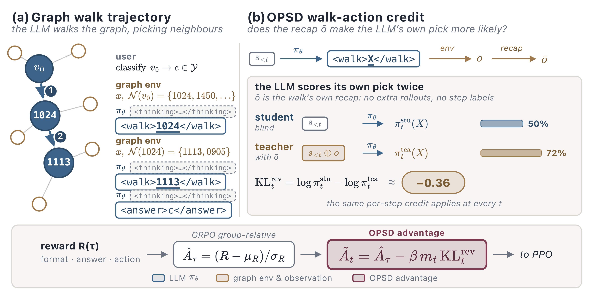

# CNY: Call Neighbours Yourself

**Call Neighbours Yourself: Graph Walks with Destination-Conditioned On-Policy Self-Distillation**
*Yilun Liu, Boyu Luo, Yanran Tang, Ruihong Qiu, Zi Huang*  ·  EMNLP 2026

[](https://arxiv.org/abs/2608.29588)
[](https://huggingface.co/Allen-UQ/CNY-14B)
[](https://huggingface.co/Allen-UQ/CNY-7B)
[](https://huggingface.co/datasets/Allen-UQ/CNY-data)
[](LICENSE)

<p align="center">
  
</p>

CNY is an RL framework that lets an LLM explore a text-attributed graph with
topology-constrained **walk actions** instead of reasoning over a pre-selected
neighbour set. Evidence is acquired on demand: a neighbour's full text stays hidden
until the policy chooses to walk to it.

At every step the policy emits one of two turn types, a walk or an answer:

```
<thinking>...</thinking><walk>1024</walk>    reveal node 1024's full text and its 1-hop neighbours
<thinking>...</thinking><walk>1113</walk>    walk again, now from the extended frontier
<thinking>...</thinking><answer>3</answer>   commit a label index
```

This is the trajectory in panel (a) above: the policy starts at the target node
$v_0$, walks to 1024, then to 1113 exposed by that first walk, and only then answers.

Because a walk's quality only becomes observable after the destination is revealed,
CNY adds **destination-conditioned on-policy self-distillation (OPSD)**: the policy
re-scores its own walk action under a short recap of where it landed, and the
resulting per-token signal sharpens neighbour selection while staying fully
on-policy, with no annotated trajectories, external judge or extra rollouts.

The walk environment, reward, OPSD signal and the slime/Megatron/SGLang training
glue are in this repository. Prompts, graphs and trained checkpoints are distributed
through Hugging Face. The released configurations cover the two models reported in
the paper: Qwen2.5-7B-Instruct and Qwen2.5-14B-Instruct.

## 1. Install

```bash
pip install -e .
```

That is enough for evaluation against a served model. Training additionally needs the
bundled trainer in `slime/` (PyTorch + Megatron-LM + SGLang on CUDA GPUs); build the
container from `slime/docker` and see `slime/README.md`.

## 2. Data

```bash
bash scripts/fetch_data.sh
```

This pulls [`Allen-UQ/CNY-data`](https://huggingface.co/datasets/Allen-UQ/CNY-data)
and lays it out as the code resolves it in `walker/_data.py`:

| Path | Contents |
|---|---|
| `data/train.jsonl` | training prompts, 8-dataset mixture (317,495 episodes) |
| `data/eval/<dataset>.jsonl` | held-out prompts, one file per evaluation setting |
| `data/raw_datasets/<dataset>.pt` | graphs read during `<walk>` |

The mixture is 230,660 node-classification episodes over seven graphs plus 86,835
WN18RR relation-classification episodes. Prompts ship pre-built. Each episode carries
its `task_type` (`node_class`, `relation_class`, `graph_reason`), label map and walk
budget, so the reward and
parsing paths in `walker/search/` are fully determined by the data. Every prompt set
on the Hub sits next to the `config_snapshot.yaml` it was generated from, which fixes
the preview length, neighbour cap, topology radius and random state.

Available evaluation settings, selected with `--set eval_dataset=<name>`:

| `eval_dataset` | Rows | Task |
|---|---|---|
| `cora` / `cora_2way` | 540 | node classification, 7-way / 2-way |
| `wikics` / `wikics_5way` | 2,340 | node classification, 10-way / 5-way |
| `products` | 37,745 | node classification, full test split |
| `products_10way` / `products_5way` | 3,000 | node classification, fixed n-way subsets |
| `fb15k237_edge_tag` | 20,466 | relation classification, 10-way |
| `expla_graph_walk` | 554 | graph-level stance judgement |
| `webqsp_walk` | 1,628 | open-ended multi-hop KGQA |

## 3. Train

Two configurations, one per reported model:

| Config | Model | Topology |
|---|---|---|
| `configs/train_qwen2.5-7b.yaml` | Qwen2.5-7B-Instruct | 2 GPUs, Megatron TP=2, 1000 rollouts |
| `configs/train_qwen2.5-14b.yaml` | Qwen2.5-14B-Instruct | 4 GPUs, Megatron TP=4, 500 rollouts |

Both use OPSD with `opd_kl_coef=0.03`, `teacher_reuse_student` (the student SGLang
engine doubles as the teacher), `lr=1e-6`, `rollout_batch_size=32`,
`n_samples_per_prompt=8`, `global_batch_size=256`, and the walk budget
`walker_max_hops=5`, `walker_neighbor_limit=3`, `walker_node_content_tokens=120`,
`walker_preview_tokens=20`.

Edit the model, container and venv paths at the top of a config, then submit:

```bash
sbatch --account=<acct> --partition=<part> --gres=gpu:h100:2 \
       scripts/sbatch_train.sh configs/train_qwen2.5-7b.yaml
```

The launcher starts an Apptainer instance, brings up a Ray head, downloads the base
checkpoint if absent and hands off to `walker.run`. Dry runs need no GPU:

```bash
python -m walker.run --exp configs/train_qwen2.5-7b.yaml --show
python -m walker.run --exp configs/train_qwen2.5-7b.yaml --print-slime-args
python -m walker.run --exp configs/train_qwen2.5-7b.yaml --no-train
```

### Multi-node

`scripts/sbatch_train.sh` covers a single node. The 14B run used 4 nodes x 1 GPU,
which requires the Ray cluster to exist before launching. On every node, start one
Apptainer instance:

```bash
apptainer instance start --nv \
  -B "$(pwd):/walker" \
  -B <host-raw-datasets>:/walker/data/raw_datasets:ro \
  -B <host-xdg-cache>:/walker_xdg \
  -B <host-hf-cache>:/hf_ckpt \
  -B <host-ckpt-dir>:/walker/outputs/walker/ckpt \
  -B <venv>:<venv>:ro \
  <slime.sif> cny_ray_0
```

Then start Ray inside each instance. Three flags are load-bearing:

```bash
apptainer exec \
  --pwd /walker \
  --env PYTHONPATH=<venv>/lib/python3.12/site-packages:/walker/slime:/walker:/workspace/Megatron-LM:/root/Megatron-LM \
  --env RAY_EXPERIMENTAL_NOSET_CUDA_VISIBLE_DEVICES=1 \
  instance://cny_ray_0 \
  ray start --head --node-ip-address <head-ip> --port <port> \
    --num-gpus 1 --object-store-memory 34359738368 \
    --disable-usage-stats --include-dashboard=false
```

* Without `--env PYTHONPATH=...` a Ray actor imports the container's own stale
  `/root/slime` and `RolloutManager.__init__` fails on `start_rollout_servers`.
* Without `RAY_EXPERIMENTAL_NOSET_CUDA_VISIBLE_DEVICES=1` Ray rewrites
  `CUDA_VISIBLE_DEVICES` and `SGLangEngine.__init__` raises `IndexError`, because its
  index disagrees with the Slurm cgroup view of the node.
* Without `--pwd /walker` actors inherit `$HOME` as their working directory and
  resolve `data/raw_datasets/<dataset>.pt` outside the bind, failing mid-rollout.

Non-head nodes use the same template with `ray start --address <head-ip>:<port>`.
Bind the checkpoint directory to a path outside the working tree, since `--save`
writes under `outputs/walker/ckpt/<wandb_group>`. Then, on the head:

```bash
RAY_ADDRESS=<head-ip>:<port> NUM_GPUS=1 \
  python -m walker.run --exp configs/train_qwen2.5-14b.yaml
```

## 4. Evaluate

```bash
bash scripts/fetch_checkpoint.sh Allen-UQ/CNY-14B
python -m sglang.launch_server --model-path checkpoints/CNY-14B --port 30000
```

Point `configs/eval.yaml` at the endpoint (`backend_url`, `model`), then:

```bash
python -m walker.eval.run --exp configs/eval.yaml                                   # cora
python -m walker.eval.run --exp configs/eval.yaml --set eval_dataset=wikics
python -m walker.eval.run --exp configs/eval.yaml --set eval_dataset=webqsp_walk
python -m walker.eval.aggregate --root outputs/bench                                # results table
```

Set `eval_subsample: 0` in `configs/eval.yaml` to score the full test split, which is
what the reported numbers use. The benchmark reports accuracy, macro-F1 and format
validity, writes one `*.summary.json` sidecar per run and is resumable.

## 5. Layout

```
walker/run.py          config -> slime argv -> launch
walker/config.py       every knob settable from configs/*.yaml
walker/search/         walk environment, turn parsing, rewards, token alignment
walker/opd/            destination-conditioned self-distillation: teacher branch, per-step signal
walker/train/          slime hooks, rollout adapter, trainer entry
walker/tag/            graph loading and neighbour access used during <walk>
walker/eval/           benchmark runner and results aggregation
slime/                 vendored trainer (THUDM/slime, Apache-2.0)
```

Prompt construction is not part of this repository; the prompt sets it produced are
published as data, each with the `config_snapshot.yaml` that generated it.

## Citation

```bibtex
@inproceedings{liu2026cny,
  title     = {Call Neighbours Yourself: Graph Walks with Destination-Conditioned On-Policy Self-Distillation},
  author    = {Yilun Liu and Boyu Luo and Yanran Tang and Ruihong Qiu and Zi Huang},
  booktitle = {EMNLP},
  year      = {2026}
}
```

## Licence

Apache-2.0, see [LICENSE](LICENSE) and [NOTICE](NOTICE).
